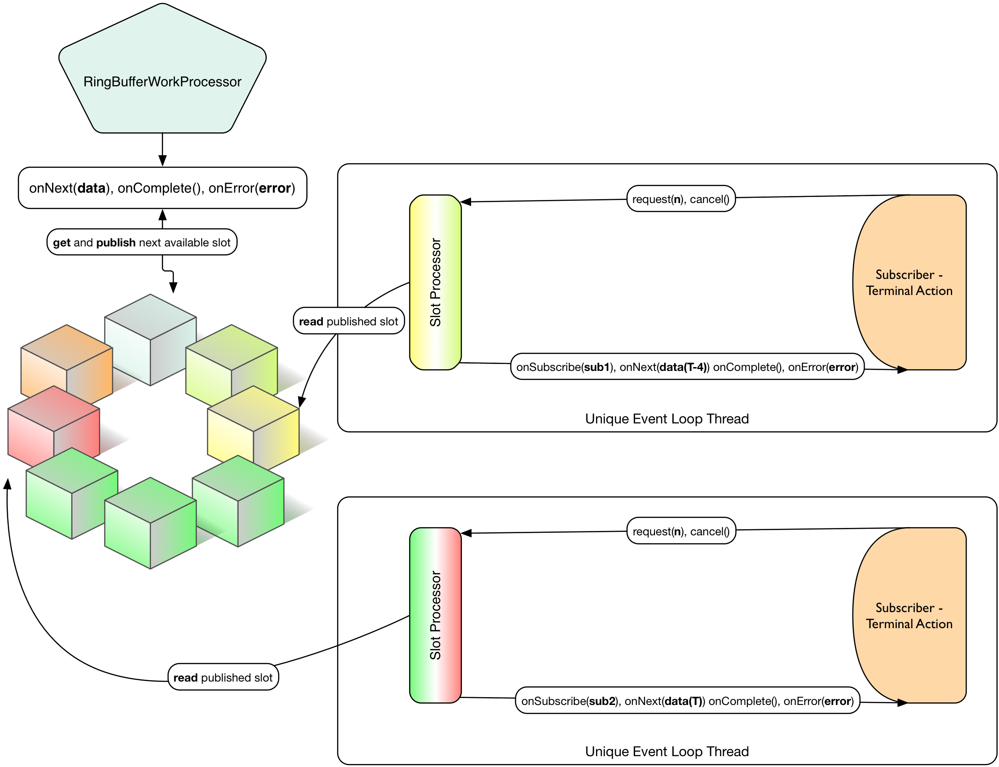

[[core-processor]]
ifndef::env-github[]
== Core Processors
endif::[]

Core Processors are here to do a more focused job than Dispatchers:
Computing asynchronous tasks *with back-pressure support*.

They also play nicely with other *Reactive Streams* vendors since they directly implement the https://github.com/reactive-streams/reactive-streams-jvm/blob/master/api/src/main/java/org/reactivestreams/Processor.java[org.reactivestreams.Processor] interface.
Remember that a Processor is both a Subscriber AND a Publisher, so you can insert it in a Reactive Streams chain where you wish (source, processing, sink).

[IMPORTANT]
The specification doesn't recommend specifically to hit Processor.onNext directly. We do offer that support but the backpressure will of course not be propagated except with eventual blocking.
One can explicitely use an anonymous Subscription to pass first to a Processor using Processor.onSubscribe to get the backpressure feedback within the implemented request method.

[IMPORTANT]
OnNext must be serialized e.g. coming from a single thread at a time (no concurrent onXXX signal is allowed). However Reactor supports it if the Processors are created using the conventioned *Processor.share()* method, e.g. RingBufferProcessor.share().
This decision must be taken at creation time in order to use the right coordination logic within the implementation, so choose wisely: _is this going to be a a standard publishing sequence_ (no concurrent) or is this going to be _hit by multiple threads_ ?

.Reactor makes a single exception to the standard when it comes to the specific XXXX *Work* Processor artefacts:
****
* Usually Reactive Streams Processor will dispatch the same sequence data asynchronously to all Subscribers subscribed at a given time T. It's akin to *Publish/Subscribe* pattern.
* *WorkProcessors* will distribute the data to its convenience, making the most of each Subscriber. That means Subscribers at a given time T will always see distinct data. It's akin to *WorkQueue* pattern.
****

== RingBuffer Processors
Using the Disruptor RingBuffer-based Reactive Streams Processor for über high throughput.

[[core-rbp]]
=== RingBufferProcessor

Reactor's link:/docs/api/index.html?reactor/core/processor/RingBufferProcessor.html[RingBufferProcessor] component is essentially a https://github.com/LMAX-Exchange/disruptor[Disruptor RingBuffer] adapted to the Reactive Streams API. Its purpose is to provide as close to bare-metal efficiency as possible. It is intended for situations where you need to dispatch tasks onto another thread with extremely low overhead and extremely high throughput and manage backpressure in your workflow.

.RingBufferProcessor at a given time T, with 2 Subscribers, all consuming the same sequence, but delta consuming rate is allowed until the ring buffer is full. This will happen when blue cube is colliding with its next clockwise yellow cube.
image::images/RBP.png[Ring Buffer message passing, width=500,align="center"]

To create a `RingBufferProcessor`, you use static `create` helper methods.

[source,java]
----
Processor<Integer, Integer> p = RingBufferProcessor.create("test", 32); // <1>
Stream<Integer> s = Streams.wrap(p); // <2>

s.consume(i -> System.out.println(Thread.currentThread() + " data=" + i)); // <3>
s.consume(i -> System.out.println(Thread.currentThread() + " data=" + i)); // <4>
s.consume(i -> System.out.println(Thread.currentThread() + " data=" + i)); // <5>

input.subscribe(p); // <6>
----
<1> Create a `Processor` with an internal RingBuffer capacity of 32 slots.
<2> Create a Reactor `Stream` from this Reactive Streams `Processor`.
<3> Each call to `consume` creates a Disruptor `EventProcessor` on its own `Thread`.
<4> Each call to `consume` creates a Disruptor `EventProcessor` on its own `Thread`.
<5> Each call to `consume` creates a Disruptor `EventProcessor` on its own `Thread`.
<6> Subscribe this `Processor` to a Reactive Streams `Publisher`.

Each element of data passed to the Processor's `Subscribe.onNext(Buffer)` method will be "broadcast" to all consumers. There's no round-robin distribution with this `Processor` because that's in the `RingBufferWorkProcessor`, discussed below. If you passed the integers 1, 2 and 3 into the `Processor`, you would see output in the console similar to this:

----
Thread[test-2,5,main] data=1
Thread[test-1,5,main] data=1
Thread[test-3,5,main] data=1
Thread[test-1,5,main] data=2
Thread[test-2,5,main] data=2
Thread[test-1,5,main] data=3
Thread[test-3,5,main] data=2
Thread[test-2,5,main] data=3
Thread[test-3,5,main] data=3
----

Each thread is receiving all values passed into the `Processor` and each thread gets the values in an ordered way since it's using the `RingBuffer` internally to manage the slots available to publish values.

[[work]]
=== RingBufferWorkProcessor

Unlike the standard `RingBufferProcessor`, which broadcasts its values to all consumers, the `RingBufferWorkProcessor` partitions the incoming values based on the number of consumers. Values come into the `Processor` and are sent to the various threads (because each consumer has its own thread) in a round-robin fashion, while still using the internal `RingBuffer` to efficiently manage the publication of values by providing backpressure to the producer when appropriate.

.RingBufferWorkProcessor at a given time T, with 2 Subscribers, each consuming unique sequence (availabilty FIFO), delta consuming rate is allowed until the ring buffer is full. This will happen when blue cube is colliding with its next clockwise yellow cube.

To use the `RingBufferWorkProcessor`, the only thing you have to change from the above code sample is the reference to the static `create` method. You'll use the one on the `RingBufferWorkProcessor` class itself instead. The rest of the code remains identical.

[source,java]
----
Processor<Integer, Integer> p = RingBufferWorkProcessor.create("test", 32); // <1>
----
<1> Create a `Processor` with an internal RingBuffer capacity of 32 slots.

Now when values are published to the `Processor`, they will not be broadcast to every consumer, but be partitioned based on the number of consumers. When we run this sample, we see output like this now:

----
Thread[test-2,5,main] data=3
Thread[test-3,5,main] data=2
Thread[test-1,5,main] data=1
----

Reactor's `Processor` components can be used to create extremely efficient, low-latency work pools into which you can safely dump 10's of millions of events per second (assuming your business logic can handle that volume). When the slots are full and all consumers are busy, the `Processor` will produce backpressure on the upstream components in the usual RingBuffer way.