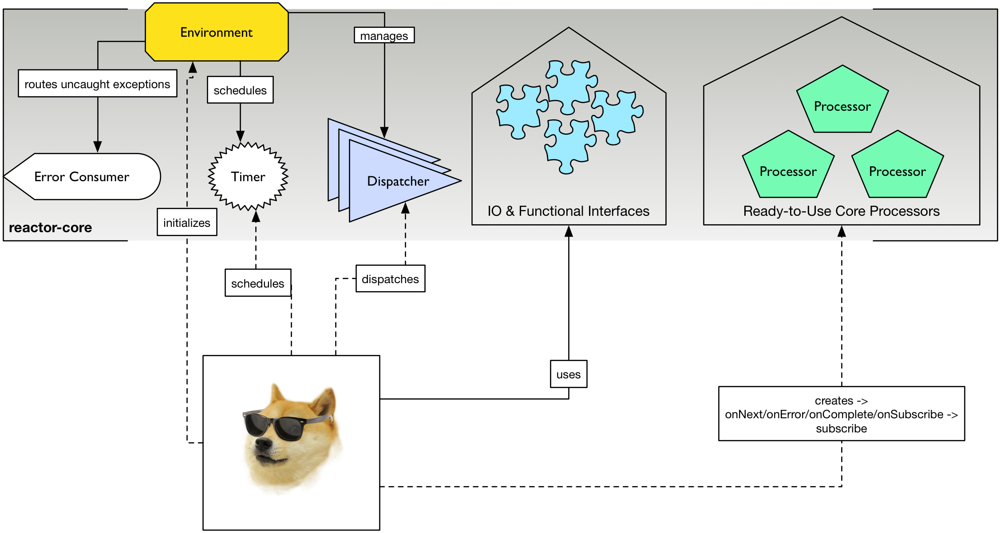

"You should never do your asynchronous work alone."
-- Jon Brisbin, After writing Reactor 1

"You should never do your asynchronous work alone."
-- Stephane Maldini, After writing Reactor 2

----

----

.Head first with a Groovy example of some Core work
[source,groovy]
----
//Initialize context and get default dispatcher
Environment.initialize()

//RingBufferDispatcher with 8192 slots by default
def dispatcher = Environment.sharedDispatcher()

//Create a callback
Consumer<Integer> c = { data ->
        println "some data arrived: $data"
}

//Create an error callback
Consumer<Throwable> errorHandler = { it.printStackTrace }

//Dispatch data asynchronously
r.dispatch(1234, c, errorHandler)

Environment.terminate()
----

== Core Overview

.How Doge can use Reactor-Core

*Reactor Core* has the following artefacts:

****
* *Common IO & functional types*, some directly backported from Java 8 Functional Interfaces
** Function, Supplier, Consumer, Predicate, BiConsumer, BiFunction
** Tuples
** Resource, Pausable, Timer
** Buffer, Codec and a handful of predifined Codecs
* *Environment* context
* *Dispatcher* contract and a handful of predefined Dispatchers
* Predefined *Reactive Streams Processor*
****

Alone, reactor-core can already be used as a drop-in replacement for another Message-Passing strategy, to schedule timed tasks or to organize your code in small functional blocks implementing the Java 8 backport interfaces.
Such breakdown allows to play more nicely with other Reactive libraries especially removing the burden of understanding the RingBuffer for the impatient developer.

[[core-functional]]
== Functional Artefacts
Functional reusable blocks are core and mostly a required artefact to use as soon as you get into Reactor. footnoteref:[disclaimer,Unless you only want to use the Core Processor which are mostly standalone at this stage. We also plan to align Dispatcher with Core Processors overtime.]
So what's cool about Functional Programming ? One of the core ideas is to start treating executable code as a data like another. footnotref:[disclaimer, Some will challenge that over-simplified vision but let's stay pragmatic over here :)
To some extent it is akin to the concept of Closures or Anonymous Functions, where business logic can be decided by the original caller avoid loads of imperative IF/SWITCH blocks.
The very difference with the quoted patterns is that every Functional component gives the explicit intent of its general role:

* https://github.com/reactor/reactor/blob/master/reactor-core/src/main/java/reactor/fn/Consumer.java[Consumer]: simple callback - fire-and-forget
* https://github.com/reactor/reactor/blob/master/reactor-core/src/main/java/reactor/fn/BiConsumer.java[BiConsumer]: simple callback with two arguments (often used in sequence comparaisons, e.g. previous and next arguments)
* https://github.com/reactor/reactor/blob/master/reactor-core/src/main/java/reactor/fn/Function.java[Function]: transforming logic - request/reply
* https://github.com/reactor/reactor/blob/master/reactor-core/src/main/java/reactor/fn/Consumer.java[BiFunction]: transforming with two arguments (often used in accumulators, comparing previous and next arguments then returning a new value)
* https://github.com/reactor/reactor/blob/master/reactor-core/src/main/java/reactor/fn/Supplier.java[Supplier]: factory logic - polling
* https://github.com/reactor/reactor/blob/master/reactor-core/src/main/java/reactor/fn/Predicate.java[Predicate]: testing logic - filtering

.The good news about wrapping executable instructions within Functional artefacts is that you can reuse them like *Lego Blocks*.
[source,java]
----
Consumer<String> consumer = new Consumer<String>(){
        @Override
        void accept(String value){
                System.out.println(value);
        }
}

//Now in Java 8 style for brievety
Function<Integer, String> transformation = integer -> ""+integer;

Supplier<Integer> supplier = () -> 123;

BiConsumer<Consumer<String>, String> biConsumer = (callback, value) -> {
        for(int i = 0; i < 10; i++){
                //lazy evaluate the final logic to run
                callback.accept(value);
        }
};

//note how the execution flows from supplier to biconsumer
biConsumer.accept(
        consumer,
        transformation.apply(
                supplier.get()
        )
);
----

It might not sound like a striking revolution at first, however this basic mindset change will reveal precious for
our mission to make asynchronous code sane and composable. The Dispatchers will use Consumer for their typed Data and Error callbacks.
The Reactor Streams module will use all these artifacts for greater good as well.

You might have noticed these interfaces are strongly typed with Generic support and a small fixed number of argument.
So how do you pass more than 1 or 2 arguments ? The answer is in one class : *Tuple*.
Tuples are like typed CSV lines in a single object instance, you want them in functional programming to keep both the type safety and a variable number of arguments.

Let's take the previous example and try replacing the double-argument BiConsumer with a single-argument Consumer:

[source,java]
----

Consumer<Tuple2<Consumer<String>, String>> biConsumer = tuple -> {
        for(int i = 0; i < 10; i++){
                //Correct typing, compiler happy
                tuple.getT1().accept(tuple.getT2());
        }
};

biConsumer.accept(
        Tuple.of(
                consumer,
                transformation.apply(supplier.get())
        )
);
----

[NOTE]
Tuples involve a bit more allocation, and that's why the common use cases of comparison or keyed signals are handled with Bi**** artifacts directly.

[[core-dispatchers]]
== Environment and Dispatchers
Using Environment and Dispatchers to compute or schedule (a)synchronous tasks.

[[core-codecs]]
== Codecs and Buffer
Working with Codecs and Buffer to marshall/unmarshall bytes efficiently.