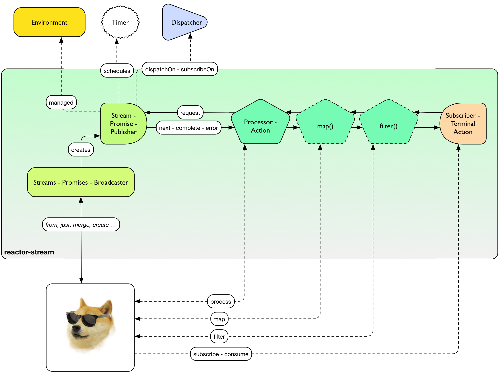
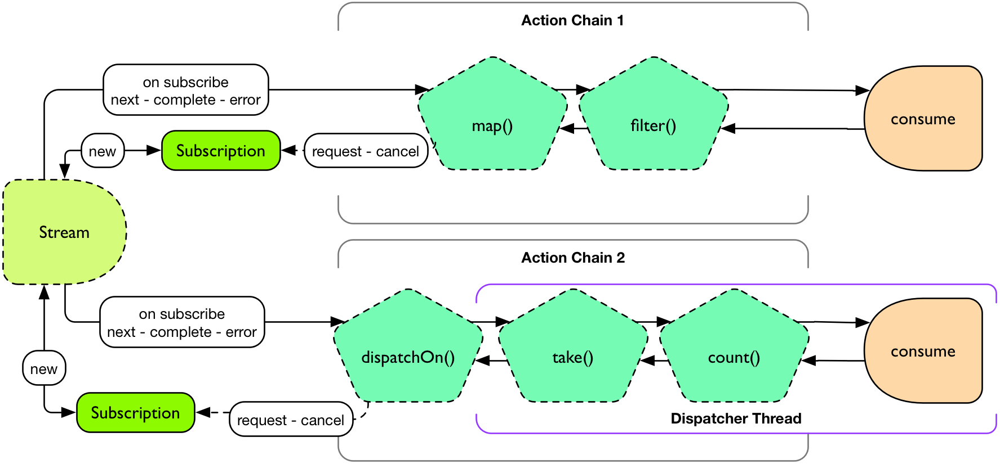

"Nope, you shall not use Future.get(), ever."
-- Stephane Maldini, with a Banking Sector Customer

.Head first with a Java 8 example of some Stream work
[source,java]
----
import static reactor.Environment.*;
import reactor.rx.Streams;
import reactor.rx.BiStreams;

//...

Environment.initialize()

//find the top 10 words used in a list of String
Streams.from(aListOfString)
  .dispatchOn(sharedDispatcher())
  .flatMap(sentence ->
    Streams
      .from(sentence.split(" "))
      .dispatchOn(cachedDispatcher())
      .filter(word -> !word.trim().isEmpty())
      .observe(word -> doSomething(word))
  )
  .map(word -> Tuple.of(word, 1))
  .window(1, TimeUnit.SECONDS)
  .flatMap(words ->
    BiStreams.reduceByKey(words, (prev, next) -> prev + next)
      .sort((wordWithCountA, wordWithCountB) -> -wordWithCountA.t2.compareTo(wordWithCountB.t2))
      .take(10)
      .finallyDo(event -> LOG.info("---- window complete! ----"))
  )
  .consume(
    wordWithCount -> LOG.info(wordWithCount.t1 + ": " + wordWithCount.t2),
    error -> LOG.error("", error)
  );
----

[[streams]]
== Coordinating tasks with Streams and Promises

.How Doge can use Reactor-Stream

*Reactor Streams* has the following artefacts:

****
* Static *Factories*, the one-stop-shops to create the related components
** `Streams` for `Stream` creation from well-defined data sources (iterable, nothing, future, Publisher...)
** `BiStreams` for key-value `Stream<Tuple2>` processing (reduceByKey...)
** `IOStreams` for <<streams.adoc#streams-persistent, Persisting>> and <<core-codec#core-codecs, Decoding>> `Streams`
** `Promises` for single-data-only `Promise`
* `Stream` and its direct implementations
** Contains *reactive extensions* and other composition API
** The extensions are usually created with the factories (`Streams.from(Iterable)` -> IterableStream, `Streams.from(Future)` -> FutureStream...)
* `Promise` with a specific https://promisesaplus.com[A+ flavored] API
** Can be transformed back to Stream with `Promise.stream()`
* `Action` and its direct implementations of every operation provided by the `Stream` following the *Reactive Streams Processor* specification
** They are not created directly in general, but with the Stream API (`Stream.map()` -> MapAction, `Stream.filter()` -> FilterAction...)
* `Broadcaster`, the publish/subscribe interfaces for dynamic data dispatch
** Unlike <<core-processor#core-processor,Core Processors>>, they will usually not bother buffering data if there is no subscriber attached
** However the `BehaviorBroadcaster` can replay the latest signal to the new Subscribers
****

[NOTE]
Do not confuse `reactor.rx.Stream` with the new JDK 8 `java.util.stream.Stream`. The latter does not offer a Reactive Streams based API nor Reactive Extensions.
However the API is quite complete around primitive types and Collections, in fact it's quite interesting for JDK 8 enabled applications to mix them both.

[[streams-basics]]
== Streams Basics
Reactor offers `Stream` or `Promise` based on the Reactive Streams standard to compose statically typed data pipelines.

It is an incredibly useful and flexible component. It's flexible enough to be used to just compose asynchronous actions together like RxJava's `Observable`. But it's powerful enough it can function as an asynchronous work queue that forks and joins arbitrary compositions or other Reactive Streams components coming from one of the other implementors of the standard.footnoteref:[reactive-streams-implementors, including http://akka.io[Akka Streams], http://ratpack.io[Ratpack], and https://github.com/ReactiveX/RxJava[RxJava]]

.There are basically two rough categories of streams
****
* A *hot* `Stream` is unbounded and capable of accepting input data like a sink.
** Think *UI events* such as _mouse clicks_ or realtime *feeds* such as _sensors_, _trade positions_ or _Twitter_.
** Adapted backpressure strategies mixed with the Reactive Streams protocol will apply
* A *cold* `Stream` is bounded and generally created from a fixed collection of data like a `List` or other `Iterable`.
** Think *Cursored Read* such as _IO reads_, _database queries_,
** Automatic Reactive Streams backpressure will apply
****

[NOTE]
====
As seen <<core.adoc#core-dispatchers, previously>>, Reactor uses an `Environment` to keep sets of `Dispatcher` instances around for shared use in a given JVM (and classloader). An `Environment` instance can be created and passed around in an application to avoid classloading segregation issues or the static helpers can be used. Throughout the examples on this site, we'll use the static helpers and encourage you to do likewise. To do that, you'll need to initialize the static `Environment` somewhere in your application.

[source,java]
----
static {
  Environment.initialize();
}
----
====

== Creating Streams and Promises

This is where you start if you are the owner of the data-source and want to just make it Reactive with direct access to various _Reactive Extensions_ and _Reactive Streams_ capacities.

Sometimes it's also a case for expanding an existing *Reactive Stream Publisher* with `Stream` API and we fortunately offer one-shot static API to proceed to the conversion.

Extending existing Reactor `Stream` like we do with `IterableStream`, `SingleValueStream` etc is also an incentive option to create a `Publisher` ready source (Stream implements it) injected with Reactor API.

[IMPORTANT]
====
Streams and Promises are relatively inexpensive, our microbenchmark suite succeeds into creating more than 150M/s on commodity hardware.
Most of the Streams stick to the *Share-Nothing* pattern, only creating new immutable objects when required.

Every operation will return a new instance:
[source, java]
----
Streams<A> stream = Streams.just(a);
Streams<B> transformedStream = stream.map(transformationToB);

Assert.isTrue(transformationStream != stream);
stream.subscribe(subscriber1); //subscriber1 will see the data A unaltered
transformedStream.subscribe(subscriber2); //subscriber2 will see the data B after transformation from A.

//Note theat these two subscribers will materialize independant stream pipelines, a process we also call lifting
----
====

=== From Cold Data Sources

You can create a `Stream` from a variety of sources, including an `Iterable` of known values, a single value to use as the basis for a flow of tasks, or even from blocking structures such as `Future` of `Supplier`.

.Streams.just()
[source,java]
----
Stream<String> st = Streams.just("Hello ", "World", "!"); // <1>

st.dispatchOn(Environment.cachedDispatcher()) // <2>
  .map(String::toUpperCase) // <3>
  .consume(s -> System.out.printf("%s greeting = %s%n", Thread.currentThread(), s)); // <4>
----
<1> Create a `Stream` from a known value but do not assign a default `Dispatcher`.
<2> `.dispatchOn(Dispatcher)` tells the `Stream` which thread to execute tasks on. Use this to move execution from one thread to another.
<3> Transform the input using a commonly-found convention: the map() method.
<4> Produce demand on the pipeline, which means "start processing now". It's an optimize shortcut for `subscribe(Subscriber)` where the Subscriber just requests Long.MAX_VALUE by default.

[IMPORTANT]
Cold Data Sources will be replayed from start for every fresh Subscriber passed to `Stream.subscribe(Subscriber)`, and therefore duplicate consuming is possible.

.Creating pre-determined Streams and Promises
[cols="2,1,6", options="header"]
|===

|Factory method
|Data Type
|Role

|Streams.<T>empty()
|T
|Only emit `onComplete()` once *requested by its Subscriber*.

|Streams.<T>never()
|T
|Never emit anything. Useful for keep-alive behaviors.

|Streams.<T>fail(Throwable)
|T
|Only emit `onError(Throwable)`.

|Streams.from(Future<T>)
|T
|Block the `Subscription.request(long)` on the passed `Future.get()` that might emit `onNext(T)` and `onComplete()` otherwise `onError(Throwable)` for any exception.

|Streams.from(T[])
|T
|Emit N `onNext(T)` elements everytime `Subscription.request(N)` is invoked. If N == Long.MAX_VALUE, emit everything. Once all the array has been read, emit `onComplete()`.

|Streams.from(Iterable<T>)
|T
|Emit N `onNext(T)` elements everytime `Subscription.request(N)` is invoked. If N == Long.MAX_VALUE, emit everything. Once all the array has been read, emit `onComplete()`.

|Streams.range(long, long?)
|Long
|Emit a sequence of N `onNext(Long)` everytime `Subscription.request(N)` is invoked. If N == Long.MAX_VALUE, emit everything. Once the inclusive upper bound been read, emit `onComplete()`.

|Streams.just(T, T?, T?, T?, T?, T?, T?, T?)
|T
|An optimization over `Streams.from(Iterable)` that just behaves similarly. Also useful to emit Iterable, Array or Future without colliding with the Streams.from() signatures.

|Streams.generate(Supplier<T>)
|T
|Emit `onNext(T)` from the producing `Supplier.get()` factory everytime `Subscription.request(N)` is called. The demand N is ignored as only one data is emitted. When a null value is returned, emit `onComplete()`.

|Promises.syncTask(Supplier<T>), Promises.task(?, Supplier<T>)
|T
|Emit a single `onNext(T)` and `onComplete()` from the producing `Supplier.get()` on the first `Subscription.request(N)` received. The demand N is ignored.

|Promises.success(T)
|T
|Emit `onNext(T)` and `onComplete()` whenever a `Subscriber` is provided to `Promise.subscribe(Subscriber)`.

|Promises.error(Throwable)
|T
|Emit `onError(Throwable)` whenever a `Subscriber` is subscribed is provided to `Promise.subscribe(Subscriber)`.

|===

[[streams-reactivestreams]]
=== From Existing Reactive Publishers

Existing Reactive Streams `Publishers` can very well be from other implementations, including the user ones, or from Reactor itself.

The use cases incude:
****
* <<streams.adoc#streams-combine, Combinatory API>> to coordinate various data sources.
* Lazy resource access, reading a Data Source on subscribe or on request, e.g. _Remote HTTP calls_.
* Data-oriented operations such as Key/Value `Tuples Streams`, `Persistent Streams` or Decoding.
* Plain Publisher decoration with `Stream API`
****

.Streams.concat() and Streams.wrap() in action
[source,java]
----
Processor<String,String> processor = RingBufferProcessor.create();

Stream<String> st1 = Streams.just("Hello "); // <1>
Stream<String> st2 = Streams.just("World "); // <1>
Stream<String> st3 = Streams.wrap(processor); // <2>

Streams.concat(st1, st2, st3) // <3>
  .reduce( (prev, next) -> prev + next ) // <4>
  .consume(s -> System.out.printf("%s greeting = %s%n", Thread.currentThread(), s)); // <5>

processor.onNext("!");
processor.onComplete();
----
<1> Create a `Stream` from a known value.
<2> Decorate the core processor with `Stream` API. Note that `Streams.concat()` would have accepted the processor directly as a valid Publisher argument.
<3> Concat the 3 upstream sources (all st1, then all st2, then all st3).
<4> Accumulate the input 2 by 2 and emit the result on upstream completion, after the last complete from st3.
<5> Produce demand on the pipeline, which means "start processing now".

.Creating from available Reactive Streams Publishers
[cols="2,1,6", options="header"]
|===

|Factory method
|Data Type
|Role

|Streams.create(*Publisher<T>*)
|T
|Only subscribe to the passed `Publisher` when the first `Subscription.request(N)` hits the returned `Stream`.
Therefore it supports malformed Publishers that do not invoke `Subscriber.onSubscribe(Subscription)` as required per specification.

|Streams.wrap(*Publisher<T>*)
|T
|A simple delegating `Stream` to the passed `Publisher.subscribe(Subscriber<T>)` argument. Only supports _well formed_ Publishers correctly using the Reactive Streams protocol *(onSubscribe > onNext\* > (onError \| onComplete)?*).

|Streams.defer(*Supplier<Publisher<T>>*)
|T
|A lazy Publisher access using the level of indirection provided by `Supplier.get()` everytime `Stream.subscribe(Subscriber)` is called.

|Streams.switchOnNext(*Publisher<Publisher<T>>*)
|T
|A Stream alterning in FIFO order between emitted `onNext(Publisher<T>)` from the passed Publisher. The signals will result in downstream Subscriber<T> receiving the next Publisher sequence of `onNext(T)`.
It might interrupt a current upstream emission when the `onNext(Publisher<T>)` signal is received.

|Streams.concat(*Publisher<T>*, _Publisher<T>*_),
Streams.concat(*Publisher<Publisher<T>>*)
|T
|If a Publisher<T> is already emitting, wait for it to `onComplete()` before draining the next pending Publisher<T>. As the name suggests its useful to http://rxmarbles.com/#concat[concat various datasources] and keep ordering right.

|Streams.merge(*Publisher<T>, Publisher<T>*, Publisher<T>*),
Streams.merge(*Publisher<Publisher<T>>*)
|T
|http://rxmarbles.com/#merge[Accept multiple sources] and *interleave* their respective sequence. Order won't be preserved like with `concat`. Demand from a Subscriber will be splitted between various source with a minimum of 1 by upstream to make sure everyone has a chance to send something.

|Streams.combineLatest(*Publisher<T1>, Publisher<T2>*, _Publisher<T3-N>\*_, *Function<Tuple2-N, C>*)
|C
|http://rxmarbles.com/#combineLatest[Combine most recent emitted elements] from the passed sources using the given `Function` aggregating function.

|Streams.combineLatest(*Publisher<T1>, Publisher<T2>,* _Publisher<T3-N>\*_, *Function<Tuple2-N, C>*)
|C
|http://rxmarbles.com/#zip[Combine most recent emitted elements once], everytime every source has emitted a signal, apply the given `Function` and clear the temporary aggregate. Effectively it's a flexible _join_ mechanism for multiple different type of sources.

|Streams.join(*Publisher<T>, Publisher<T>*, _Publisher<T>*>_)
|List<T>
|A shortcut for zip that only aggregate each complete aggregate in a List matching the order of the passed argument sources.

|Streams.await(*Publisher<?>*, _long, unit, boolean_)
|void
|Block the calling thread until the passed `Publisher` `onComplete` the waiting internal `Subscriber`. Optional arguments to tune the timeout and the need to request data as well can be passed. It will throw an exception if the final state is `onError` instead.

|IOStreams.<K,V>persistentMap(*String*, _deleteOnExit_)
|V
|<<streams.adoc#streams-persistent, A simple shortcut over ChronicleStream constructors>>, a disk-based log appender/tailer. The name argument must match an existing persistent queue under /tmp/persistent-queue\[name\].

|IOStreams.<K,V>persistentMapReader(*String*)
|V
|<<streams.adoc#streams-persistent, A simple shortcut over ChronicleReaderStream constructors>>, a disk-based log tailer. The name argument must match an existing persistent queue under /tmp/persistent-queue\[name\].

|IOStreams.decode(*Codec<SRC, IN, ?>, Publisher<SRC>*)
|IN
|Use <<core.adoc#core-codecs, Codec decoder>> to decode the passed source data type into *IN* type.

|BiStreams.reduceByKey(*Publisher<Tuple2<KEY,VALUE>>*, _Map<KEY,VALUE>, Publisher<MapStream.Signal<KEY, VALUE>>_, *BiFunction<VALUE, VALUE, VALUE>*)
|Tuple2<KEY,VALUE>
|A key-value operation that accumulates computed results for each 2 sequential `onNext(VALUE)` passed to the `BiFunction` argument. The result will be released `onComplete()` only. The options allow to use an existing map store and listen for its events.

|BiStreams.scanByKey(*Publisher<Tuple2<KEY,VALUE>>*, _Map<KEY,VALUE>, Publisher<MapStream.Signal<KEY, VALUE>>_, *BiFunction<VALUE, VALUE, VALUE>*)
|Tuple2<KEY,VALUE>
|A key-value operation that accumulates computed results for each 2 sequential `onNext(VALUE)` passed to the `BiFunction` argument. The result will be released every time just after it has been stored.  The options allow to use an existing map store and listen for its events.

|Promises.when(*Promise<T1>, Promise<T2>*, _Promise<T3-N>*_)
|TupleN<T1,T2,*?>
|Join all unique results from `Promises` and provide for the new `Promise` with the aggregated `Tuple`.

|Promises.any(*Promise<T>, Promise<T>*, _Promise<T>*_)
|T
|Pick the first signal available among the passed promises and `onNext(T)` the returned `Promise` with this result.

|Promises.multiWhen(*Promise<T>, Promise<T>*, _Promise<T>*_)
|List<T>
|Join all unique results from `Promises` and provide for the new `Promise` with the aggregated `List`. The difference with the `when` alternative is that the type of promises must match.

|===

=== From Custom Reactive Publishers

Over time, the Reactor user will become more familiar with the *Reactive Streams*. That's the perfect moment to start custom reactive data-sources!
Usually the implementor would have to respect the specification and verify his work with the *reactive-streams-tck* dependency.
Respecting the contract requires a *Subscription* and a call to *onSubscribe* + a *request(long)* before sending any data.

However Reactor allows some flexibility to only deal with the message passing part and will automatically provide the buffering *Subscription* transparently,
the difference is demonstrated in the code sample below.

.Streams.create and Streams.defer in action
[source,java]
----
final Streams<String> stream1 = Streams.create(sub -> {

  sub.onSubscribe(new Subscription(){ // <1>
    void request(long demand){
      if(demand == 2L){
        sub.onNext(1);
        sub.onNext(2);
        sub.onComplete();
      }
    }

    void cancel(){
      System.out.println("Cancelled!");
    }
  });
});

final Streams<String> stream2 = Streams.create(sub -> {
  sub.onNext(3); // <2>
  sub.onNext(4);
  sub.onComplete();
});

final AtomicInteger counterSubscribe = new AtomicInteger();

Streams<String> deferred = Streams.defer( () -> {
  if(counterSubscriber.incrementAndGet() == 1){ // <3>
    return stream1;
  }else{
    return stream2;
  }
});

deferred
  .consume(s -> System.out.printf("%s greeting = %s%n", Thread.currentThread(), s)); // <4>
----
<1> Create a `Stream` from a custom valid `Publisher` which first calls `onSubscribe(Subscription)`.
<2> Create a `Stream` from a custom malformed `Publisher which skips `onSubscribe(Subscription)` and immediately calls `onNext(T)`.
<3> Create a `DeferredStream` that will alternate source Publisher<T> on each `Stream.subscribe` call, evaluating the total number of Subscribers,

Where to go from here ? Well there are tons of use cases that can benefit from a custom Publisher:

****
* Reactive Facade to convert any IO call with a matching demand and compose: HTTP calls (read N times), SQL queries (select max N), File reads (read N lines)...
* Async Facade to convert any hot data callback into a composable API: AMQP Consumer, Spring MessageChannel endpoint...
****

Reactor offers some done-deal facilities to avoid boilerplate checking you would have to do without extending exsiting Stream or `PushSubscription`

* Extending `PushSubscription` instead of implementing directly `Subscription` to benefit from terminal state (PushSubscription.isComplete())
* Extending `Stream` instead of implementing directly `Publisher` to benefit from composition API

A good place to start thinking the reactive stream way is the <<recipes.adoc#recipe-filestream,sample File Stream>>.

=== From Hot Data Sources

If you are dealing with an unbounded stream of data items like what would be common with a web application that accepts user input via a REST interface, you probably want to use the "hot" variety of `Stream` in Reactor, which we call a link:/docs/api/index.html?reactor/rx/stream/Broadcaster.html[Broadcaster].

To use it, you simply declare a pipeline of composable, functional tasks on the `Broadcaster` and later call link:/docs/api/reactor/rx/stream/Broadcaster.html#onNext-O-[`Broadcaster.onNext(T)`] to publish values into the pipeline.

.Broadcaster.create()
[source,java]
----
Broadcaster<String> sink = Broadcaster.create(Environment.get()); // <1>

sink.map(String::toUpperCase) // <2>
    .consume(s -> System.out.printf("%s greeting = %s%n", Thread.currentThread(), s)); // <3>

sink.onNext("Hello World!"); // <4>
----
<1> Create a `Broadcaster` using the default, shared `RingBufferDispatcher` as the `Dispatcher`.
<2> Transform the input using a commonly-found convention: the map() method.
<3> `.consume()` is a "terminal" operation, which means it produces demand in Reactive Streams parlance.
<4> Publish a value into the pipeline, which will cause the tasks to be invoked.

[IMPORTANT]
Hot Data Sources will never be replayed. Subscribers will only see data from the moment T they have been passed to `Stream.subscribe(Subscriber)`.
An exception applies for `BehaviorBroadcaster` (last emitted element is replayed); `Streams.timer()` and `Streams.period()` will also maintain a unique timed cursors but will still ignore backpressure.

.Creating undetermined Streams
[cols="3*", options="header, autowidth"]
|===

|Factory
|Type
|Role

|Streams.timer(delay, unit?, timer?)
|Long
|Start a Timer on `Stream.subscribe(Subscriber)` call and emit a single `onNext(0L)` then `onComplete()` once the delay is elapsed. Be sure to pass the optional argument `Timer` if there is no current active `Environment`.
`Subscription.request(long)` will be ignore as no backpressure can apply to a scheduled emission.

|Streams.period(period, unit, timer?)
|Long
|Start a Timer on `Stream.subscribe(Subscriber)` call and every period of time emit `onNext(N)` where N is an incremented counter starting from 0. Be sure to pass the optional argument `Timer` if there is no current active `Environment`.
`Subscription.request(long)` will be ignore as no backpressure can apply to a scheduled emission.

|Streams.<T>switchOnNext()
|Publisher<T>, T
|An `Action` which for the record is also a `Processor`. The `onNext(Publisher<T>)` signals will result in downstream Subscriber<T> receiving the next Publisher sequence of `onNext(T)`.
 It might interrupt a current upstream emission when the `onNext(Publisher<T>)` signal is received.

|Broadcaster.create()
|T
|

|SerializedBroadcaster.create()
|T
|

|BehaviorBroadcaster.create()
|T
|

|BehaviorBroadcaster.first()
|T
|

|Streams.wrap(Processor<?,T>)
|T
|

|Promises.prepare, Promises.ready
|T
|

|===

[[wireup]]
=== Wiring a Stream up

Streams operations minor a few exceptions (terminal actions and `broadcast()`) will never directly subscribe. Instead they will lazily prepare for subscribe.
This is usually called *lift* in Functional programming.

That basically means the Reactor Stream user will explicitely call `Stream.subscribe(Subscriber)` or alternative *terminal* actions such as `Stream.consume(Consumer)` to materialize all the registered operations.
Before that, `Actions` don't really exist, we use `Stream.lift(Supplier)` to defer the creation of these Actions until `Stream.subscribe(Subscriber)` is explicitely called.

Once everything is wired, each action maintains an upstream `Subscription` and a downstream `Subscription` and the Reactive Streams contract applies all along the pipeline.

[IMPORTANT]
Usually the terminal actions return a `Control` object instead of `Stream`.
This is an interface with user-code to request or cancel a pipeline without being inside a `Subscriber` context or implementing the full `Subscriber` contract.

.Wiring up 2 pipelines
[source, java]
----
import static reactor.Environment.*;
import reactor.rx.Streams;
import reactor.rx.Stream;
//...

Stream<String> stream = Streams.just("a","b","c","d","e","f","g","h");

//prepare two unique pipelines
Streams<Long> actionChain1 = stream.map(String::toUpperCase).filter(w -> w.equals("c"));
Streams<Long> actionChain2 = stream.dispatchOn(sharedDispatcher()).take(5).count();

actionChain1.consume(System.out::println); //start chain1
Control c = actionChain2.consume(System.out::println); //start chain2
//...
c.cancel(); //force this consumer to stop receiving data
----

.After Wiring

==== Publish/Subscribe
For *Fan-Out* to subscribers from a unified pipeline, `Stream.process(Processor)`, `Stream.broadcast()`, `Stream.broadcastOn()` and `Stream.broadcastTo()` can be used.

.Sharing an upstream pipeline and wiring up 2 downstream pipelines
[source, java]
----
import static reactor.Environment.*;
import reactor.rx.Streams;
import reactor.rx.Stream;
//...

Stream<String> stream = Streams.just("a","b","c","d","e","f","g","h");

//prepare a shared pipeline
Stream<String> sharedStream = actionChain1.observe(System.out::println).broadcast();

//prepare two unique pipelines
Streams<Long> actionChain1 = sharedStream.map(String::toUpperCase).filter(w -> w.equals("c"));
Streams<Long> actionChain2 = sharedStream.take(5).count();

actionChain1.consume(System.out::println); //start chain1
actionChain2.consume(System.out::println); //start chain2
----

.After Wiring a Shared Stream
image::images/broadcast.png[The 3 Pipelines wired, width=650, align="center", link="images/broadcast.png"]

.Operations considered terminal or explicitely subscribing
[cols="2,6", options="header"]
|===

|Stream<T> method
|Role

|Stream.subscribe(Subscriber)
|

|Stream.consume(Consumer), Stream.consumeOn(Consumer)
|

|Stream.consumeLater()
|

|Stream.tap()
|Create a *terminal action* unbounded `Tap` that will be dynamically updated everytime a new `onNext(T)` is signalled.

|Stream.batchConsume, Stream.batchConsumeOn
|

|Stream.adaptiveConsume, Stream.adaptiveConsumeOn
|

|Stream.next()
|

|Stream.toList()
|

|Stream.toBlockingQueue()
|

|cache()
|Turn any Stream into a *Cold* Stream, able to replay all the sequence of signals indivudally for each Subscriber.
Due to the unbounded nature of the action, consider to use with small sequences.

|broadcast(), broadcastOn(Environment, Dispatcher)
|Turn Any Stream into a *Hot* Stream. This will prevent pipeline duplication by immediately subscribing and ready to publish the signal to N Subscribers downstream.
The demand will be aggregated fro all child Subscribers.

|broadcastTo(Subscriber)
|An alternative to `Stream.subscribe` which allows method chaining since the returned instance is the same than the passed argument.

|process(Processor)
|

|===

=== Setting Capacity

The Reactive Streams standard encourages application developers to set reasonable limits on in-flight data. This prevents components from becoming innudated with more data than they can handle, which causes unpredictable problems throughput an application. One of the core concepts of Reactive Streams is that of "backpressure", or the ability for a pipeline to communicate to upstream components that it can only handle a fixed number of items at a time. A useful term to describe this process of queueing and requesting small chunks of a large volume of data is "microbatching".

Within a Reactor `Stream`, it's possible to microbatch items to limit the amount of data in-flight at any given time. This has distinct advantages in a number of ways, not the least of which is that it limits expsoure to data loss by preventing the system from accepting more data than it can afford to lose if the system was to crash.

To limit the amount of data in-flight in a `Stream`, use the link:/docs/api/reactor/rx/Stream.html#capacity-long-[`.capacity(long)`] method.

.Streams.just()
[source,java]
----
Stream<String> st;

st.capacity(256) // <1>
  .consume(s -> service.doWork(s)); // <2>
----
<1> Limit the amount of data in-flight to no more than 256 elements at a time.
<2> Produce demand upstream by requesting the next 256 elements of data.

=== Functional Composition

Similar to many other functional libraries, Reactor provides a number of useful methods for composing functions on a `Stream`. You can passively observe values, transform them from one kind to another, filter out values you don't want, buffer values until a size or time trigger is tripped, and many other useful operations.

These operations are called `Actions`, and they will not <<streams.adoc#wireup,wire up the `Stream` directly>>. They are available on any `Stream` instance, which means <<streams.adoc#streams-basic,you should have one by this stage>>.

==== Observe

If you want to passively observe data as it passes through the pipeline, then use the `.observe(Consumer)` methods. To observe values, use link:/docs/api/reactor/rx/Stream.html#observe-reactor.fn.Consumer-[`.observe(Consumer<? super T>)`]. To observe errors without dealing with them definitively, use link:/docs/api/reactor/rx/Stream.html#observeError-java.lang.Class-reactor.fn.BiConsumer-[`.observe(Class<? extends Throwable>, BiConsumer<Object,? extends Throwable>)`]. To observe the Reactive Streams complete signal, use link:/docs/api/reactor/rx/Stream.html#observeComplete-reactor.fn.Consumer-[`.observeComplete(Consumer<Void>)`]. To observe the cancel signal, use link:/docs/api/reactor/rx/Stream.html#observeCancel-reactor.fn.Consumer-[`.observeCancel(Consumer<Void>)`]. To observe the Reactive Streams subscribe signal, use link:/docs/api/reactor/rx/Stream.html#observeSubscribe-reactor.fn.Consumer-[`.observeSubscribe(Consumer<? super Subscription<T>>)`].

.observe(Consumer<T>)
[source,java]
----
Stream<String> st;

st.observe(s -> LOG.info("Got input [{}] on thread [{}}]", s, Thread.currentThread())) // <1>
  .observeComplete(v -> LOG.info("Stream is complete")) // <2>
  .observeError(Throwable.class, (o, t) -> LOG.error("{} caused an error: {}", o, t)) // <3>
  .consume(s -> service.doWork(s)); // <4>
----
<1> Passively observe values passing through without producing demand.
<2> Run once all values have been processed and the `Stream` is marked complete.
<3> Run any time an error is propagated.
<4> Produce demand on the pipeline and consume any values.

==== Filter

It's possible to filter items passing through a `Stream` so that downstream actions only see the data you want them to see. This is accomplished by using the link:/docs/api/reactor/rx/Stream.html#filter-reactor.fn.Predicate-[`.filter(Predicate<T>)`] method.

.filter(Predicate<T>)
[source,java]
----
Stream<String> st;

st.filter(s -> s.startsWith("Hello")) // <1>
  .consume(s -> service.doWork(s)); // <2>
----
<1> This will only allow values that start with the string `'Hello'` to pass downstream.
<2> Produce demand on the pipeline and consume any values.

==== Transformation

.Stream.map(Function<T,V>)
[source,java]
----
Streams
  .range(1, 100) // <1>
  .map(number -> ""+number) // <2>
  .subscribe(new DefaultSubscriber<String>(){ // <3>
    void onSubscribe(Subscription sub){
      sub.request(100);
    }

    void onNext(String s){
      System.out.println(s);
    }
  });
----

==== (A)Sync Transformation: FlatMap

.Stream.take(long)
[source,java]
----
Streams
  .range(1, 100) // <1>
  .take(50)
  .consume(
    System.out::println,
    Throwable::printStackTrace,
    avoid -> System.out.println("--complete--")
  );
----

==== Limits

.Stream.take(long)
[source,java]
----
Streams
  .range(1, 100) // <1>
  .take(50)
  .consume(
    System.out::println,
    Throwable::printStackTrace,
    avoid -> System.out.println("--complete--")
  );
----

==== Blocking

.Waiting for a Stream or Promise
[cols="2,6", options="header"]
|===

|Functional API or Factory method
|Role

|Stream.await()
|

|Stream.toList() and Promise.await(), Promise.get()
|

|Stream.next() and Promise.await(), Promise.get()
|

|Stream.toBlockingQueue()
|

|Wiring up Synchronous Streams
|

|===
[[streams-multithreading]]
== Understanding the threading model

.Jumping between threads
[cols="2,6", options="header"]
|===

|Functional API or Factory method
|Role

|Stream.subscribeOn()
|

|Stream.dispatchOn()
|

|Stream.process(Processor)

|===

[[streams-microbatching]]
== MicroBatching
TODO Using a `Stream` as a `MicroBatching` strategy to aggregate small payloads.

.Chunk processing with Stream
[cols="2,6", options="header"]
|===
|Functional API or Factory method
|Role

|Stream.buffer()
|

|Stream.window()
|

|===

=== Into a simple List

[source,java]
----
long timeout = 100;
final int batchsize = 4;
int parallelStreams = 16;
CountDownLatch latch = new CountDownLatch(1);

final Broadcaster<Integer> streamBatcher = Broadcaster.<Integer>create(env);
streamBatcher
  .buffer(batchsize, timeout, TimeUnit.MILLISECONDS)
  .consume(i -> latch.countDown()));

streamBatcher.onNext(12);
streamBatcher.onNext(123);
streamBatcher.onNext(42);
streamBatcher.onNext(666);

boolean finished = latch.await(2, TimeUnit.SECONDS);
if (!finished)
  throw new RuntimeException(streamBatcher.debug().toString());
else {
  System.out.println(streamBatcher.debug().toString());
  assertEquals("Must have correct latch number : " + latch.getCount(), latch.getCount(), 0);
}
----

=== Into Windows

[source,java]
----
//create a list of 1000 numbers and prepare a Stream to read it
Stream<Integer> sensorDataStream = Streams.from(createTestDataset(1000));

//wait for all windows of 100 to finish
CountDownLatch endLatch = new CountDownLatch(1000 / 100);

Control controls = sensorDataStream
  .window(100)
  .consume(window -> {
    System.out.println("New window starting");
    window
      .reduce(Integer.MAX_VALUE, (acc, next) -> Math.min(acc, next))
      .finallyDo(o -> endLatch.countDown())
      .consume(i -> System.out.println("Minimum " + i));
  });

endLatch.await(10, TimeUnit.SECONDS);
System.out.println(controls.debug());

Assert.assertEquals(0, endLatch.getCount());
----

[[streams-backpressure]]
== Backpressure and Overflow

.Controlling the volume of in-flight data
[cols="2,6", options="header"]
|===

|Functional API or Factory method
|Role

|Stream.subscribe(Subscriber)
|

|Stream.adaptiveConsume(), Stream.batchConsume()
|

|Stream.onOverflowBuffer()
|

|Stream.onOverflowDrop()
|

|Stream.sample(), Stream.sampleFirst()
|

|Stream.throttle()
|

|Stream.capacity()
|

|Stream.process( RingBuffer*Processor )
|

|Stream.filter(), take(), takeWhile()...
|All limit operations can be used to proactively limit the volume of a Stream.

|Stream.buffer(), reduce(), count()...
|All aggregating and metrics operations can be used to proactively limit the volume of a Stream.

|===

[[streams-combine]]
== Combinatory Operations
TODO Combining multiple Reactive Streams data `Publishers` in an controlled fashion.

.Combining Data Sources
[cols="2,6", options="header"]
|===

|Functional API or Factory method
|Role

|Stream.flatMap
|

|Streams.switchOnNext(Publisher<Publisher<T>>)
|A Stream alterning in FIFO order between emitted `onNext(Publisher<T>)` from the passed Publisher. The signals will result in downstream Subscriber<T> receiving the next Publisher sequence of `onNext(T)`.
It might interrupt a current upstream emission when the `onNext(Publisher<T>)` signal is received.

|Streams.concat(Publisher<T>,Publisher<T>?*7),
Streams.concat(Publisher<Publisher<T>>),
Stream.concatWith(Publisher),
Stream.startWith(Publisher)
|If a Publisher<T> is already emitting, wait for it to `onComplete()` before draining the next pending Publisher<T>.

|Streams.merge, Stream.mergeWith
|

|Streams.combineLatest
|

|Streams.zip, Stream.zipWith,
|

|Streams.join, Stream.joinWith
|

|===

[[streams-microservice]]
== MicroServices

TODO Using a `Stream` or a `Promise` to deal with remote `MicroService` latency.

.Reading remote resources
[cols="2,6", options="header"]
|===

|Functional API or Factory method
|Role

|Stream.create(Publisher), Stream.defer(Supplier), Stream.wrap(Publisher), Stream.generate(Supplier)
|

|Stream.timeout()
|

|Stream.take()
|

|Stream.flatMap
|

|Stream.subscribeOn(), Stream.dispatchOn()

|===

[[streams-microservice-start]]
=== Creating Non-Blocking Services
[[streams-microservice-compose]]
=== Composing multiple Services Calls
[[streams-microservice-share]]
=== Choosing the right (multi)threading strategy

[[streams-errors]]
== Error Handling
Using a `Stream` to build fault tolerant pipelines.

.Handling errors
[cols="2,6", options="header"]
|===

|Functional API or Factory method
|Role

|Stream.when(Class<Throwable>, Consumer<Throwable>)
|

|Stream.materialize()
|

|Stream.recover()
|

|Stream.observeError()
|

|Stream.onErrorReturn()
|

|Stream.onErrorResume()
|

|Stream.retry()
|

|Stream.oberveError()
|

|Stream.ignoreErrors()
|

|*throw* CancelException
|

|===

[[streams-persistent]]
== Persisting Stream Data
Combining multiple Reactive Streams data `Publishers` in an controlled fashion.

.Persisting signals safely
[cols="2,6", options="header"]
|===

|Functional API or Factory method
|Role

|Stream.onOverflowBuffer()
|

|IOStreams.persistentMapReader()
|

|IOStreams.persistentMap()
|

|===

[[streams-analytics]]
== Analytics
Using a `Stream` to compute metrics and any inline stateful processing.

.Operations useful for metrics and other stateful accumulation.
[cols="2,6", options="header"]
|===

|Functional API or Factory method
|Role

|Stream.count()
|

|Stream.scan()
|

|Stream.reduce()
|

|BiStreams.reduceByKey()
|

|BiStreams.scanByKey()
|

|Stream.timestamp()
|

|Stream.elapsed()
|

|Stream.materialize()
|

|===

[[streams-partition]]
== Partitioning
Partition a `Stream` for concurrent, parallel work.

An important aspect of the functional composition approach to reactive programming is that work can be broken up into discreet chunks and scheduled to run on arbitrary Dispatchers. This means you can easily compose a flow of work that starts with an input value, executes work on another thread, and then passes through subsequent transformation steps once the result is available. This is one of the more common usage patterns with Reactor.

[source,java]
----
List<String> ids = Arrays.asList("1", "2", "3", "4", "5", "6", "7", "8", "9", "10");

DispatcherSupplier supplier1 = Environment.newCachedDispatchers(2, "pool1");
DispatcherSupplier supplier2 = Environment.newCachedDispatchers(5, "pool2");

CountDownLatch latch = new CountDownLatch(10);

Streams.from(ids)
  .dispatchOn(Environment.sharedDispatcher())
  .partition(2)
  .flatMap(stream -> stream
    .dispatchOn(supplier1.get())
    .map(s -> s + " " + Thread.currentThread().toString())
  )
  .map(t -> {
    System.out.println("First partition: "+Thread.currentThread() + ", worker=" + t);
    return t;
  })
  .partition(5)
  .flatMap(stream -> stream
    .dispatchOn(supplier2.get())
    .map(s -> s + " " + Thread.currentThread().toString())
  )
  .dispatchOn(Environment.sharedDispatcher())
  .consume(t -> {
    System.out.println("Second partition: "+Thread.currentThread() + ", worker=" + t);
    latch.countDown();
  });

assertThat("Not totally dispatched", latch.await(30, TimeUnit.SECONDS));
----

.Grouping operations
[cols="2,6", options="header"]
|===

|Functional API or Factory method
|Role

|Stream.groupBy()
|

|Stream.partition()
|

|Stream.process(XXXWorkProcessor)
|

|===

[[streams-notrx]]
== Other API beyond Rx

In addition to implementing directly the Reactive Streams, some more `Stream` methods not covered differ or are simply not documented by Reactive Extensions.

.Other methods uncovered in the previous use cases.
[cols="2,6", options="header"]
|===

|Stream method
|Role

|after
|

|process
|

|log
|

|observeSubscribe
|

|observeCancel
|

|split
|

|sort
|

|requestWhen
|

|combine
|

|keepAlive
|

|Action.debug(), StreamsUtils.debug(Stream)
|
|===